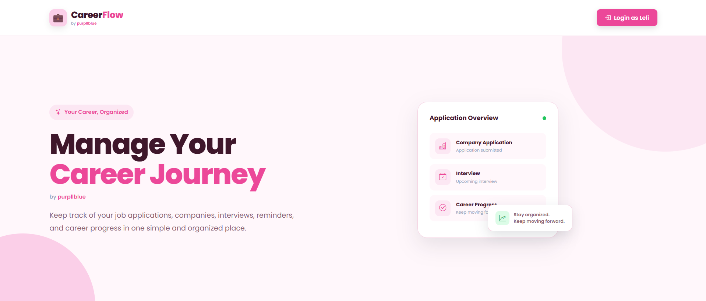
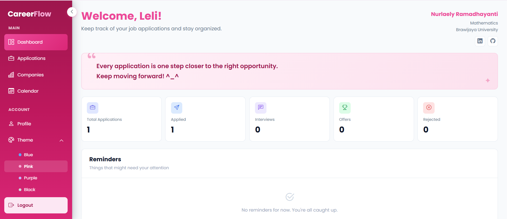
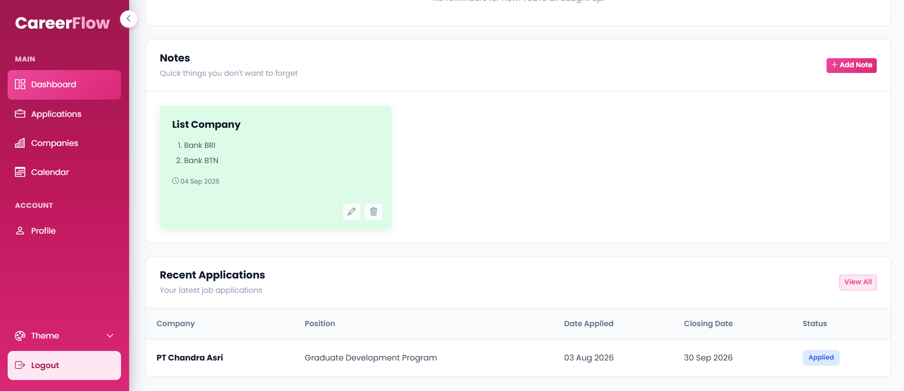
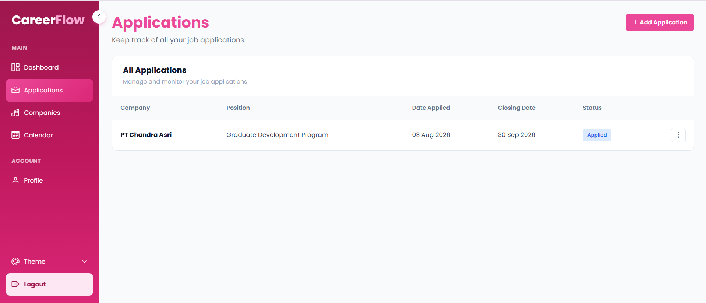
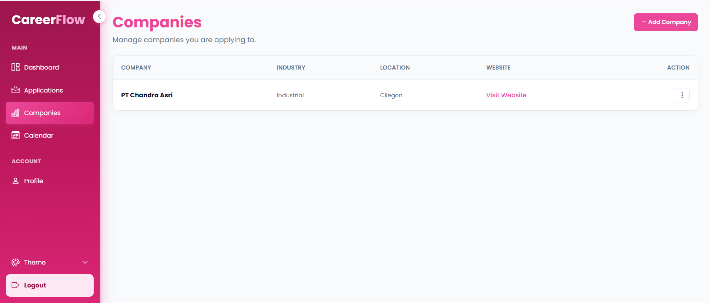
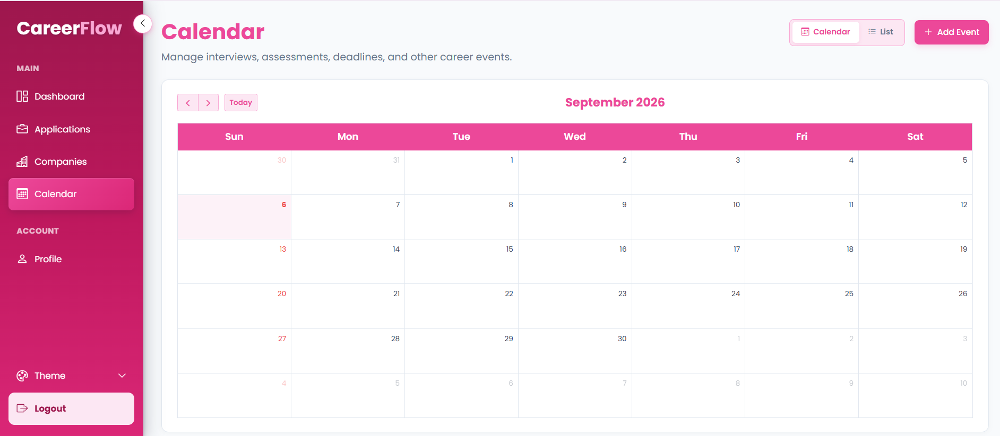

# CareerFlow

**CareerFlow** is a modern web-based job application tracker built with **PHP, MySQL, Bootstrap, HTML, CSS, and JavaScript**. It is designed to help users organize and monitor their job search process, including job applications, companies, recruitment stages, deadlines, calendar events, notes, and personal profile information.

## ✨ Features

* 📊 **Dashboard** — Overview of job applications and recruitment progress.
* 💼 **Application Management** — Add, edit, delete, and manage job applications.
* 🏢 **Company Management** — Add, edit, delete, and manage company information.
* 📅 **Calendar Management** — Add, edit, and delete important recruitment events and deadlines.
* 📝 **Notes Management** — Create, edit, and delete notes related to the job search process.
* 👤 **Profile Management** — Manage personal profile information.
* 🎨 **Theme Customization** — Choose between Blue, Pink, Purple, and Black themes.
* 📂 **Collapsible Sidebar** — Expand or collapse the navigation sidebar.
* 🔐 **Login & Logout** — Session-based authentication for accessing the application.
* 💾 **Persistent Preferences** — Theme and sidebar preferences are saved locally in the browser.

## 🛠️ Built With

* **PHP** — Backend development
* **MySQL** — Database management
* **HTML5** — Page structure
* **CSS3** — Styling and responsive design
* **JavaScript** — Interactive functionality
* **Bootstrap 5.3.7** — UI components and responsive layout
* **Bootstrap Icons 1.13.1** — Interface icons
* **XAMPP** — Local development environment

## 📸 Screenshots

### Login

> 

### Dashboard

> 
> 

### Applications

> 

### Companies

> 

### Calendar

> 

### Profile

> ![Profile(assets/css/media/profile.png)

## 📁 Project Structure

```text
CareerFlow/
├── admin/
│   ├── calendar/
│   │   ├── edit.php
│   │   ├── hapus.php
│   │   └── tambah.php
│   ├── companies/
│   │   ├── edit.php
│   │   ├── hapus.php
│   │   ├── index.php
│   │   └── tambah.php
│   ├── lamaran/
│   │   ├── edit.php
│   │   ├── hapus.php
│   │   ├── index.php
│   │   └── tambah.php
│   ├── notes/
│   │   ├── edit.php
│   │   ├── hapus.php
│   │   └── tambah.php
│   ├── calendar.php
│   ├── dashboard.php
│   ├── logout.php
│   ├── profile.php
│   └── theme.php
├── assets/
│   └── css/
│       └── theme.css
├── config/
│   └── koneksi.php
├── .gitignore
├── login.php
└── README.md
```

### Directory Overview

* **`admin/`** — Contains the main application pages available after login.
* **`admin/calendar/`** — Handles calendar event management.
* **`admin/companies/`** — Handles company data management.
* **`admin/lamaran/`** — Handles job application management.
* **`admin/notes/`** — Handles job search notes.
* **`admin/calendar.php`** — Displays the main calendar interface.
* **`admin/dashboard.php`** — Displays the main application dashboard.
* **`admin/profile.php`** — Handles personal profile information.
* **`admin/theme.php`** — Handles theme-related functionality.
* **`admin/logout.php`** — Handles user logout.
* **`assets/css/theme.css`** — Contains the application's theme styling.
* **`config/koneksi.php`** — Handles the MySQL database connection.
* **`login.php`** — Application login page.
* **`.gitignore`** — Specifies files and directories excluded from Git tracking.

## 🚀 Getting Started

### Prerequisites

Make sure you have the following installed:

* [XAMPP](https://www.apachefriends.org/)
* PHP
* MySQL
* A web browser

### Installation

1. Clone this repository:

```bash
git clone https://github.com/purpllblue/CareerFlow.git
```

2. Move the project into the XAMPP `htdocs` directory:

```text
C:\xampp\htdocs\CareerFlow
```

3. Start **Apache** and **MySQL** from the XAMPP Control Panel.

4. Create a MySQL database named:

```text
job_tracker
```

5. Import the required database tables into MySQL.

6. Check the database configuration in:

```text
config/koneksi.php
```

7. Open CareerFlow in your browser:

```text
http://localhost/CareerFlow/
```

## 🎨 Available Themes

CareerFlow provides four interface themes:

| Theme         | Description                |
| ------------- | -------------------------- |
| 🔵 **Blue**   | Default professional theme |
| 🌸 **Pink**   | Soft and vibrant theme     |
| 🟣 **Purple** | Modern purple theme        |
| ⚫ **Black**   | Dark neutral theme         |

Theme preferences are stored locally in the browser and automatically restored when the application is opened again.

## 📌 Purpose

CareerFlow was created to provide a simple and organized way to manage the job application process. It allows users to manage applications, companies, recruitment stages, deadlines, calendar events, notes, and personal information through a dedicated web application.

## 🔮 Future Improvements

Potential improvements for future versions include:

* Application statistics and analytics
* Advanced search and filtering
* Email and deadline reminders
* Document and CV management
* More advanced authentication
* Online deployment
* Further mobile responsiveness improvements

## 📄 License

This project is created for personal and educational purposes.
